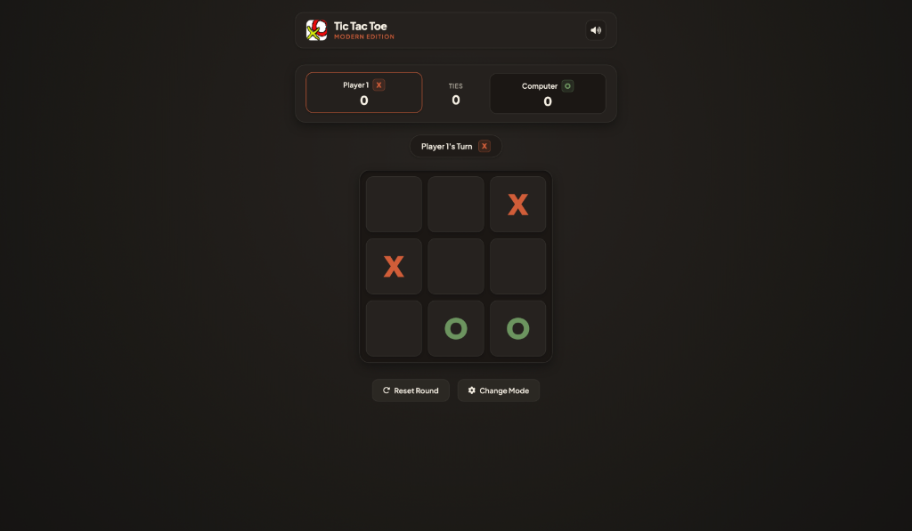

# 🎮 Modern Tic Tac Toe — The Gentleman's Game




A state-of-the-art, feature-complete web implementation of **Tic Tac Toe** originally inspired by [The Odin Project](https://www.theodinproject.com/). Refactored with a refined, warm mid-century artisanal design system, interactive audio cues, modular architecture, and an **unbeatable Minimax AI**.

---

## ✨ Features

- **🤖 Three AI Difficulties (Player vs Computer)**
  - **Easy**: Casual random play for a relaxed game.
  - **Medium**: Smart AI that prioritizes winning moves and blocks immediate player threats.
  - **Unbeatable (Minimax)**: Powered by the recursive Minimax algorithm with alpha-beta pruning. It evaluates every possible future game state to guarantee a win or force a tie!
- **👥 Player vs Player Mode**
  - Pass-and-play local multiplayer with customizable player names and symbol selection (X or O).
- **🎨 Warm Mid-Century Artisanal UI**
  - Refined espresso and cocoa palette styled with clean architectural panels, burnt terracotta and warm sage markers, and tactile natural shadows (no cyberpunk or neon glow!).
  - Rigid, strictly consistent 3x3 grid geometry that maintains exact square dimensions regardless of content or state.
  - Smooth micro-animations for cell marking, turn indicators, winning square highlights, and celebratory end-game modals.
- **🔊 Audio Effects & Sound Management**
  - Custom audio feedback for marker placements, winning matches, defeat, tie games, and invalid moves.
  - Convenient mute/unmute toggle in the header that persists audio preferences across sessions via `localStorage`.
- **📊 Real-Time Score Tracking**
  - Interactive top scoreboard keeping count of Player 1 victories, Opponent/AI victories, and Tie games across consecutive rounds.
- **🛡️ Secure & Accurate Game Logic**
  - Strict input sanitation and text rendering (`textContent`) to prevent Cross-Site Scripting (XSS).
  - Robust validation preventing illegal moves, square hijacking, or clicks while the AI is computing.
- **📱 Responsive & Accessible**
  - Seamlessly scales across desktop, tablet, and mobile screens.
  - Implements WAI-ARIA attributes, semantic HTML5 tags, keyboard navigation, and respects `@media (prefers-reduced-motion: reduce)`.

---

## 🕹️ How to Play

1. **Setup Your Game**:
   - Choose between **Player vs Computer** or **Player vs Player**.
   - If playing against the computer, select your desired **AI Difficulty** (*Easy*, *Medium*, or *Unbeatable*).
   - Enter your name(s) and select your preferred symbol (**X** or **O**).
2. **Start the Match**:
   - Click **Start Game**. Player X always takes the first turn.
   - Click any empty square on the 3x3 grid to place your marker.
3. **Winning the Game**:
   - The first player to align **3 of their symbols** horizontally, vertically, or diagonally wins the round!
   - If all 9 squares are filled without a winning alignment, the round ends in a **Tie**.

---

## 🚀 Getting Started

No bundling or compilation build step is required! This application runs natively in modern web browsers using ES6 Modules.

### 1. Clone the Repository
```bash
git clone https://github.com/hamilto8/tic-tac-toe.git
cd tic-tac-toe
```

### 2. Launch the Application
Because this project utilizes native ES6 Modules (`import` / `export`), web browsers require the files to be served over HTTP rather than direct file system access (`file://`) due to CORS security policies.

- **Using Node.js (`serve`)**:
  ```bash
  npx serve .
  ```
- **Using Python 3**:
  ```bash
  python3 -m http.server 8000
  ```
- **Using VS Code**: Install the **Live Server** extension, right-click `index.html`, and select **Open with Live Server**.

---

## 🏗️ Technical Architecture & ES6 Modules

The codebase is engineered following strict modularity and clean separation of concerns using standard ES6 Modules:

```
├── index.html     # Semantic markup, accessibility roles, UI containers & modals
├── style.css      # CSS entry point using @import for modular styling
├── css/           # Modular CSS architecture
│   ├── variables.css   # Color palette tokens, typography & CSS reset
│   ├── layout.css      # App container, header, card glass & utility classes
│   ├── components.css  # Primary and secondary button styles & hover states
│   ├── setup.css       # Game setup screen, difficulty selector & name inputs
│   ├── game.css        # Scoreboard, turn indicator, 3x3 grid & cell animations
│   ├── modals.css      # End game result modal & toast notification animations
│   └── responsive.css  # Mobile media queries & reduced motion accessibility
├── script.js      # Application entry point module
├── js/            # Modular ES6 architecture
│   ├── sound.js   # Audio loading, playback & localStorage mute persistence
│   ├── board.js   # Canonical 3x3 grid array, cell mutations & win evaluation
│   ├── ai.js      # Easy, Medium, and Unbeatable (Minimax + Alpha-Beta) AI logic
│   ├── engine.js  # Gameplay lifecycle, turn management & scorekeeping
│   └── ui.js      # DOM manipulation, event delegation, modals & toast alerts
├── images/        # Favicons & brand logos
└── sound/         # Audio effects (mp3 format)
```

### ES6 Module Organization (`js/`)
- `js/sound.js` (`SoundManager`): Handles audio playback, browser autoplay error handling, and localStorage state persistence.
- `js/board.js` (`Gameboard`): Encapsulates cell validation, empty square queries, and static winning combination evaluation.
- `js/ai.js` (`AIController`): Implements defensive board copies and decision logic for all AI difficulties.
- `js/engine.js` (`GameEngine`): Coordinates game rules, turn switching, AI triggering, round resets, and score tallying.
- `js/ui.js` (`UIController`): Manages DOM element caching, delegated event listeners, XSS-safe text rendering, toast alerts, and modals.
- `script.js`: Clean application entry point that initializes `UIController` upon DOM readiness.

### CSS Module Organization (`css/`)
- `css/variables.css`: Defines the artisanal warm palette, typography fonts, shadows, transition variables, and standard CSS reset.
- `css/layout.css`: Styles the primary `.app-container`, navigation header, branding logo, card utilities, and universal `.hidden` state.
- `css/components.css`: Reusable UI button primitives (`.btn-primary`, `.btn-secondary`, `.icon-btn`) and active/hover states.
- `css/setup.css`: Game setup controls, mode/difficulty segmented buttons, custom text input fields, and marker options.
- `css/game.css`: Scoreboard cards, turn indicator badges, equal-box 3x3 `.game-board`, `.cell` hover previews, and win animations.
- `css/modals.css`: End-game victory/tie modal overlays, icon badges, and toast notification alerts.
- `css/responsive.css`: Media queries for mobile responsiveness (`max-width: 640px`) and accessibility support (`prefers-reduced-motion: reduce`).

---

## 📜 License

This project is open-source and available under the [MIT License](LICENSE).
